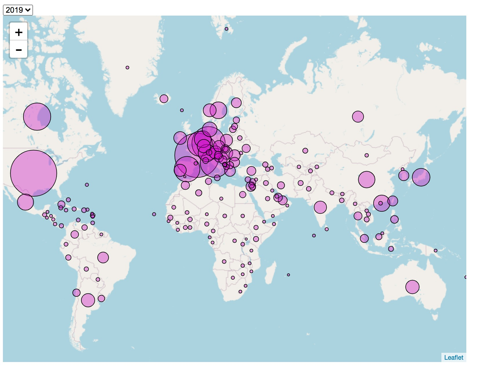

# Milestone 2 (7th May, 5pm)

## Introduction
Our project aims to visualize the evolution of movies across countries and over time. We aim to show in which countries most movies are produced and under which genre. We can develop further statistics around this main goal.

## Goals
### 1.1 Movies densities across countries:

An axample of a map that we tried to create is shown above.
It will be the our main visualization. we will work on adding the ability to select any country on click and showing as a result different statistics bases on that specific one. Some popus should be seen to make it as interactive as we would like it to be.

### 1.2 Year visualisation :
As seen in the above sketch we will try and use a toolbar for visualizing the movie industry evolution in time.
We would develop a nice desing for the choice of the time scale so that users can choose the year that they want to analyse.

### 1.3 Movies by Genre in Each country:

We aim to show the dominant genre of movies in each country. By clicking on the density of movies of a given country, we get how each genre contributes in the total of movies.

### 1.4 Average and Max Rating per Country and :

In each county we will display its average rating accross all its movies and the max rating of the best movie.

### 1.5 Best movies:
- All time best movies:

- 21st century best movies:

### 1.6 Production Companies:

- All time best production Companies:

- 21st Century best production Companies:

## Tools
- D3.js
- BootStrap
- P5